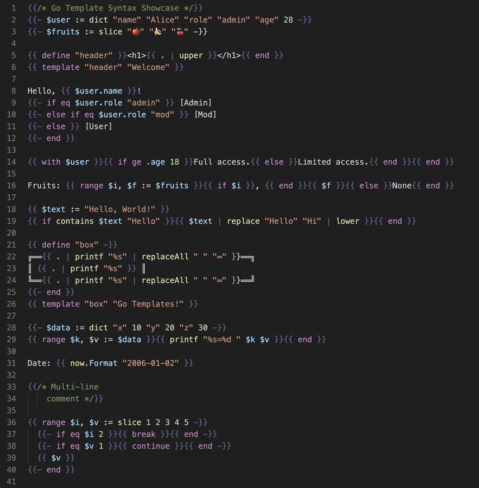
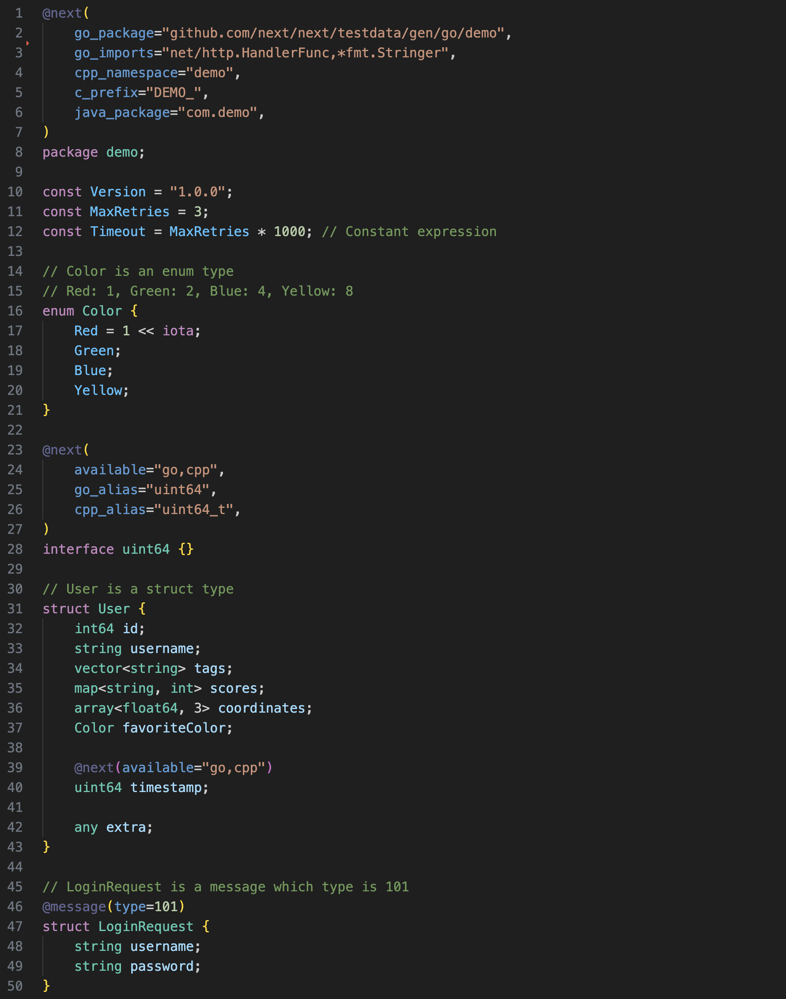

# next-lang

A Visual Studio Code extension for the Next language, its related template files, and Go templates. This extension enhances your development experience with Next language files (`.next`), Next template files (`.npl`), and Go template files (`.tmpl` and `.gotmpl`).

## Screenshot

**demo.tmpl**

---

**demo.next**

## Features

This extension provides enhanced support for Next language files (`.next`) and its associated template files (`.npl`). It also includes support for Go template files (`.tmpl` and `.gotmpl`).

Current features:
- Semantic highlighting for Next language files (`.next`)
- Syntax highlighting for Next template files (`.npl`)
- Syntax highlighting for Go template files (`.tmpl` and `.gotmpl`)

Upcoming features:
- Diagnostics
- Auto-completion
- Go to definition
- Hover information
- Code folding
- Formatting

## Installation

1. Open Visual Studio Code
2. Go to the Extensions view (Ctrl+Shift+X)
3. Search for `next lang`
4. Click Install

## Usage

Once installed, the extension will automatically activate for files with the following extensions:
- `.next` (Next language files)
- `.npl` (Next template files)
- `.tmpl` and `.gotmpl` (Go template files)

The extension will provide syntax highlighting out of the box. As more features are implemented, they will become available automatically.

## Contributing

Contributions are welcome! Please feel free to submit a Pull Request.

## License

[MIT License](LICENSE)

## Contact

If you have any questions, issues, or suggestions, please open an issue in the GitHub repository.

---

Happy coding with Next language and Go templates!